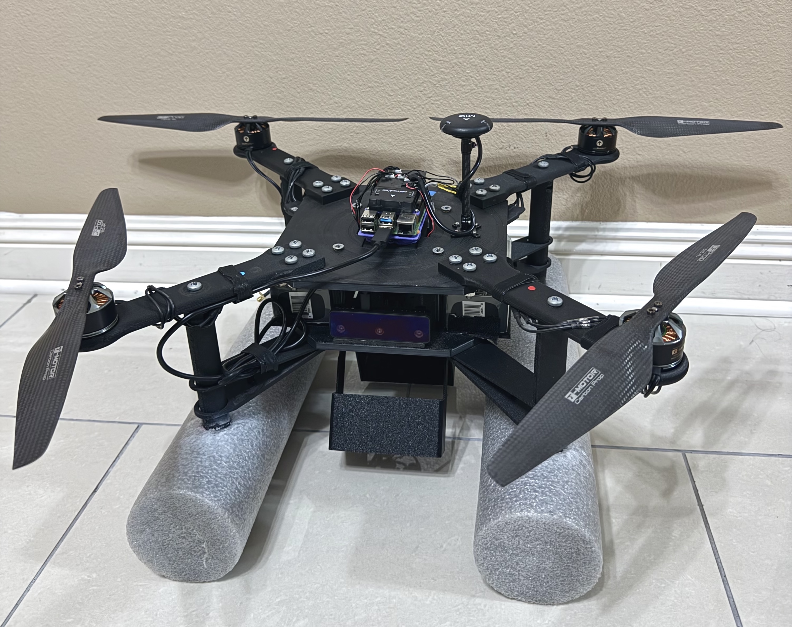

# HK-Aerial

---

### Summary
> Lead a multi-disciplinary team to design, develop, and manufacture an all-terrain payload delivery drone with object detection for Senior Design at LSU.

___
### Features

- On-board object detection and video recording
- Flight data logging
- Additive manufactured structure
- Payload delivery mechanism
- 20+ minute flight time
- Wireless communication (Range upwards of 1 mile)
- Multi-terrain landing
- Autonomous capabilities
- Emergency failsafe protocols
- 4.83kg weight (~10.6 lbs)

### Video(s)

<iframe width="560" height="315" src="https://www.youtube.com/embed/A8Q2BG28Pes?si=uL-vrQBhT9uQzM5c" title="YouTube video player" frameborder="0" allow="accelerometer; autoplay; clipboard-write; encrypted-media; gyroscope; picture-in-picture; web-share" referrerpolicy="strict-origin-when-cross-origin" allowfullscreen></iframe>

